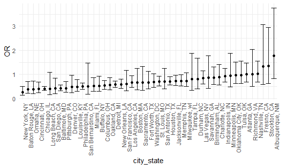
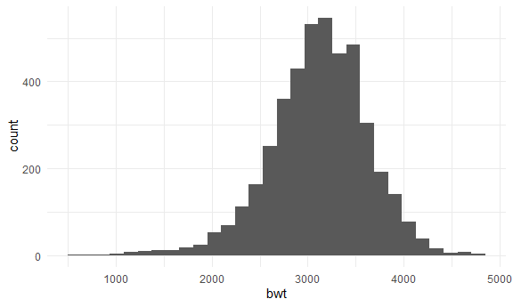
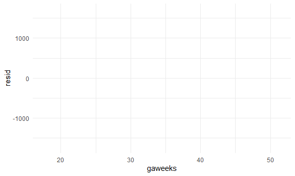
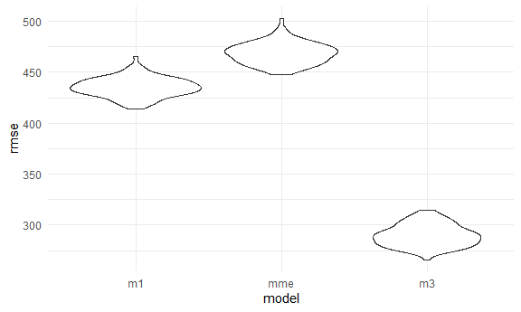
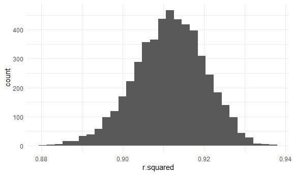
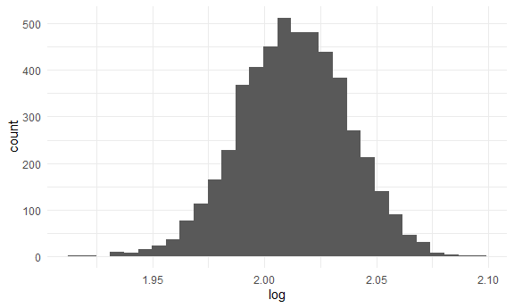

Homework 6
================
Eric Sun

Initial Setup:

``` r
library(tidyverse)
```

    ## Warning: package 'tidyverse' was built under R version 4.0.3

    ## -- Attaching packages --------------------------------------- tidyverse 1.3.0 --

    ## v ggplot2 3.3.2     v purrr   0.3.4
    ## v tibble  3.0.4     v dplyr   1.0.2
    ## v tidyr   1.1.2     v stringr 1.4.0
    ## v readr   1.3.1     v forcats 0.5.0

    ## Warning: package 'tibble' was built under R version 4.0.3

    ## -- Conflicts ------------------------------------------ tidyverse_conflicts() --
    ## x dplyr::filter() masks stats::filter()
    ## x dplyr::lag()    masks stats::lag()

``` r
knitr::opts_chunk$set(
  fig.width = 6,
  fig.asp = .6,
  out.width = "90%"
)

theme_set(theme_minimal() + theme(legend.position = "bottom"))

options(
  ggplot2.continuous.colour = "viridis",
  ggplot2.continuous.fill = "viridis"
)

scale_colour_discrete = scale_colour_viridis_d
scale_fill_discrete = scale_fill_viridis_d
```

# Problem 1

Read in data

``` r
homicide_df =
  read_csv("data/homicide-data.csv", na=c("","NA","Unknown")) %>%
  mutate(
    city_state = str_c(city, state, sep = ", "),
    victim_age = as.numeric(victim_age),
    resolution = case_when(
      disposition == "Closed without arrest" ~ 0,
      disposition == "Open/No arrest" ~0,
      disposition == "Closed by arrest" ~ 1)
        ) %>%
  filter(
    victim_race %in% c("White", "Black"),
    city_state != "Tulsa, AL") %>%
  select(city_state, resolution, victim_age, victim_race, victim_sex)
```

    ## Parsed with column specification:
    ## cols(
    ##   uid = col_character(),
    ##   reported_date = col_double(),
    ##   victim_last = col_character(),
    ##   victim_first = col_character(),
    ##   victim_race = col_character(),
    ##   victim_age = col_double(),
    ##   victim_sex = col_character(),
    ##   city = col_character(),
    ##   state = col_character(),
    ##   lat = col_double(),
    ##   lon = col_double(),
    ##   disposition = col_character()
    ## )

Start with one city

``` r
baltimore_df =
  homicide_df %>%
  filter(city_state == "Baltimore, MD")

glm(resolution ~ victim_age + victim_race + victim_sex, 
    data = baltimore_df,
    family = binomial()) %>%
  broom::tidy() %>%
  mutate(
    OR = exp(estimate),
    CI_lower = exp(estimate - 1.96 * std.error),
    CI_upper = exp(estimate + 1.96 * std.error)
  ) %>%
  select(term, OR, starts_with("CI")) %>%
  knitr::kable(digits = 3)
```

| term              |    OR | CI\_lower | CI\_upper |
| :---------------- | ----: | --------: | --------: |
| (Intercept)       | 1.363 |     0.975 |     1.907 |
| victim\_age       | 0.993 |     0.987 |     1.000 |
| victim\_raceWhite | 2.320 |     1.648 |     3.268 |
| victim\_sexMale   | 0.426 |     0.325 |     0.558 |

Try this across cities.

``` r
models_results_df = 
  homicide_df %>%
  nest(data = -city_state) %>%
  mutate(
    models = map(.x = data, ~glm(resolution ~ victim_age + victim_race + victim_sex, data = .x, family = binomial())), 
    results = map(models, broom::tidy)
  ) %>%
  select(city_state, results) %>%
  unnest(results) %>%
    mutate(
    OR = exp(estimate),
    CI_lower = exp(estimate - 1.96 * std.error),
    CI_upper = exp(estimate + 1.96 * std.error)
  ) %>%
  select(term, OR, starts_with("CI"))
```

Plot

``` r
models_results_df %>%
  filter(term == "victim_sexMale") %>%
  mutate(city_state = fct_reorder(city_state, OR)) %>%
  ggplot(aes(x = city_state, y = OR)) +
  geom_point() +
  geom_errorbar(aes(ymin= CI_lower, ymax = CI_upper)) +
  theme(axis.text.x = element_text(angle=90, hjust=1))
```



# Problem 2

Load, clean data

``` r
birthweight_df = read_csv("./data/birthweight.csv") %>%
  mutate(
    babysex = as_factor(babysex),
    frace = as_factor(frace),
    mrace = as_factor(mrace)
    )
```

    ## Parsed with column specification:
    ## cols(
    ##   .default = col_double()
    ## )

    ## See spec(...) for full column specifications.

Explore data

``` r
birthweight_df %>%
  ggplot(aes(x = bwt)) +
  geom_histogram()
```

    ## `stat_bin()` using `bins = 30`. Pick better value with `binwidth`.


Birthweights appear to be skewed to the left.

Regression model for data

``` r
model_1 = lm(bwt~gaweeks + momage + mrace + smoken + wtgain, data = birthweight_df)
model_me = lm(bwt~gaweeks, data = birthweight_df)
model_3 = lm(bwt~bhead*blength*babysex, data = birthweight_df)

broom::tidy(model_1)
```

    ## # A tibble: 8 x 5
    ##   term        estimate std.error statistic   p.value
    ##   <chr>          <dbl>     <dbl>     <dbl>     <dbl>
    ## 1 (Intercept)   834.      92.7        8.99 3.54e- 19
    ## 2 gaweeks        54.4      2.15      25.3  1.01e-131
    ## 3 momage          5.21     1.84       2.83 4.63e-  3
    ## 4 mrace2       -277.      15.1      -18.3  7.58e- 72
    ## 5 mrace3       -191.      67.3       -2.84 4.55e-  3
    ## 6 mrace4       -175.      29.7       -5.87 4.70e-  9
    ## 7 smoken        -11.2      0.920    -12.2  1.00e- 33
    ## 8 wtgain          9.42     0.612     15.4  4.86e- 52

Model 1 was developed based on using hypothesized variables that were
important and then subtracting those that were not significant (maternal
age, family income).

Plot residuals for model 1

``` r
birthweight_df %>%
  modelr::add_residuals(model_1) %>%
  modelr::add_predictions(model_1) %>%
  ggplot(aes(x = gaweeks, y=resid)) 
```



Compare 3 models

``` r
library(modelr)

cv_df =
  crossv_mc(birthweight_df, 100) %>% 
  mutate(
    train = map(train, as_tibble),
    test = map(test, as_tibble))

cv_df = 
  cv_df %>% 
  mutate(
    model_1  = map(train, ~lm(bwt~gaweeks + momage + mrace + smoken + wtgain, data = .x)),
    model_me    = map(train, ~lm(bwt~gaweeks, data = .x)),
    model_3  = map(train, ~lm(bwt~bhead*blength*babysex, data = .x))) %>% 
  mutate(
    rmse_m1 = map2_dbl(model_1, test, ~rmse(model = .x, data = .y)),
    rmse_mme    = map2_dbl(model_me, test, ~rmse(model = .x, data = .y)),
    rmse_m3 = map2_dbl(model_3, test, ~rmse(model = .x, data = .y)))
```

Plot results

``` r
cv_df %>% 
  select(starts_with("rmse")) %>% 
  pivot_longer(
    everything(),
    names_to = "model", 
    values_to = "rmse",
    names_prefix = "rmse_") %>% 
  mutate(model = fct_inorder(model)) %>% 
  ggplot(aes(x = model, y = rmse)) +
  geom_violin()
```


The best model is model 3 with the lowest RMSE but model 1 performs
better than the main effects model.

# Problem 3

Load data

``` r
weather_df = 
  rnoaa::meteo_pull_monitors(
    c("USW00094728"),
    var = c("PRCP", "TMIN", "TMAX"), 
    date_min = "2017-01-01",
    date_max = "2017-12-31") %>%
  mutate(
    name = recode(id, USW00094728 = "CentralPark_NY"),
    tmin = tmin / 10,
    tmax = tmax / 10) %>%
  select(name, id, everything())
```

    ## Registered S3 method overwritten by 'hoardr':
    ##   method           from
    ##   print.cache_info httr

    ## using cached file: C:\Users\Sunny\AppData\Local\cache/R/noaa_ghcnd/USW00094728.dly

    ## date created (size, mb): 2020-12-09 17:31:55 (7.552)

    ## file min/max dates: 1869-01-01 / 2020-12-31

Bootstrap weather dataframe tmin vs tmax. Find r-squared.

``` r
r2_df = weather_df %>%
  bootstrap(5000, id = "strap_number") %>%
  mutate(
    models = map(.x = strap, ~lm(tmax~tmin, data = .x)),
    results = map(models, broom::glance)
  ) %>%
  select(strap_number, results) %>%
  unnest(results) 

r2_df %>%
  select(strap_number, r.squared) %>%
  ggplot(aes(x=r.squared)) + 
  geom_histogram()
```

    ## `stat_bin()` using `bins = 30`. Pick better value with `binwidth`.



``` r
r2_df %>%
  summarize(
    ci_lower = quantile(r.squared, 0.025),
    ci_upper= quantile(r.squared, 0.975)
) 
```

    ## # A tibble: 1 x 2
    ##   ci_lower ci_upper
    ##      <dbl>    <dbl>
    ## 1    0.894    0.927

The r-squared distribution appears to be skewed to the right

Find log(betahat0 \* betahat1)

``` r
b01_df = weather_df %>%
  bootstrap(5000, id = "strap_number") %>%
  mutate(
    models = map(.x = strap, ~lm(tmax~tmin, data = .x)),
    results = map(models, broom::tidy)
  ) %>%
  select(strap_number, results) %>%
  unnest(results) %>%
  mutate(term=str_replace(term,"\\(Intercept\\)","intercept")) 

intercept_df = b01_df %>%
  filter(term=="intercept")

est_df = b01_df %>%
  filter(term=="tmin")

log_df = left_join(intercept_df, est_df, by="strap_number") %>%
  mutate(
    log = log(estimate.x*estimate.y)
  ) %>%
  select(strap_number, log)

log_df %>%
  ggplot(aes(x=log)) +
  geom_histogram()
```

    ## `stat_bin()` using `bins = 30`. Pick better value with `binwidth`.



``` r
log_df %>%
  summarize(
    ci_lower = quantile(log, 0.025),
    ci_upper= quantile(log, 0.975)
) 
```

    ## # A tibble: 1 x 2
    ##   ci_lower ci_upper
    ##      <dbl>    <dbl>
    ## 1     1.97     2.06

The log of the product of the coefficients appears to have a normal
distribution.
